# Esquema de coordinación de relés de  protección basados en inteligencia artificial

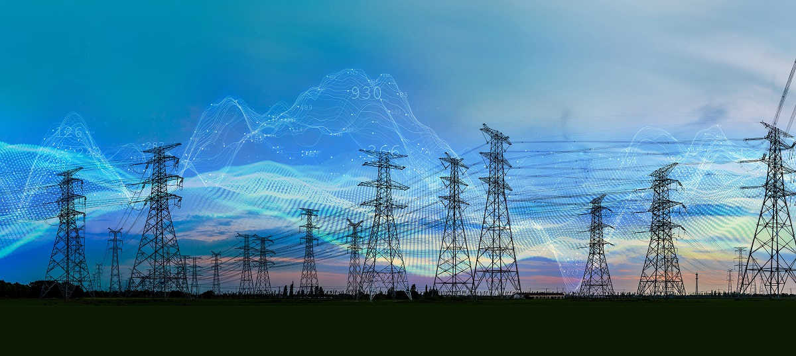

## Integrantes

* David Urbaez León.
* Juan Pablo Botero Sepúlveda.
* Angela Sofia Rosas Garces.
* Andres Osorio Santamaría.
* Manuela Granda Muñoz.

## Introducción

 En la actualidad, la sociedad ha desarrollado una dependencia directa del consumo energético, llegando al punto en que resulta inconcebible imaginar una ciudad sin suministro eléctrico. Para acceder a este servicio, es necesario superar diversos retos técnicos en el ámbito de la ingeniería eléctrica. El primer desafío radica en que la energía suele generarse en ubicaciones distantes de los centros de consumo (como centrales hidroeléctricas, parques eólicos, granjas solares, plantas térmicas, entre otros). Para transportar eficientemente esta energía, se emplean transformadores de potencia, que elevan la tensión para reducir las pérdidas eléctricas durante el transporte en alta tensión. A su llegada a la ciudad, la tensión se reduce a niveles de distribución, mitigando así los riesgos eléctricos para los usuarios. Finalmente, la energía es consumida por usuarios residenciales e industriales, cerrando el ciclo de este complejo proceso de suministro eléctrico. El proceso descrito se ilustra en la Fig. 1. 
  

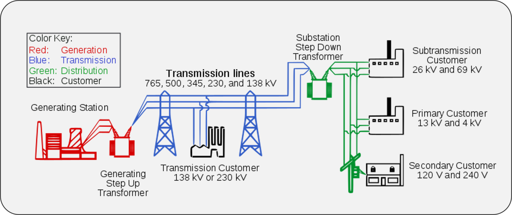

*Figura 1. Diagrama simplificado de un sistema eléctrico de potencia.*

En este proyecto se abordará un problema real del sector eléctrico asociado a la transmisión en alta tensión (Componente del sistema representado en azul en la Fig. 1.). El problema a abordar es la coordinación de los relés de protecciones, el cual se analizará desde la analítica predictiva. Pero primero, ¿ Qué es un relé de protección ?.

### ¿ Qué es un relé de protección ?

Los relés de protecciones son uno de los dispositivos más importantes de un sistema de potencia, dado que estos tienen la responsabilidad de tomar la decisión de desconectar elementos, tales como, líneas de transmisión, generadores eléctricos, cargas eléctricas tanto residenciales como industriales, entre otros. Esencialmente un relé de protección es un computador industrial especializado en el analisis de datos para comandar disparos a los interruptores del sistema de potencia.

*Figura 2. Ejemplo de un relé de protección marca Siemens.*

En los sistemas de potencia no es posible evitar las fallas eléctricas, debido a sus diferentes causas, no es posible evitar que caiga una descarga atmosferica, que suceda un terremoto que tumbe las torres de alta tensión, o que un árbol haga contacto con los conductores. Sin embargo, lo que si podemos hacer es estar preparados para cuando un evento de esta naturaleza suceda, el sistema este preparado para desconectar el elemento fallado lo más pronto posible, para garantizar así la seguridad de la operación.

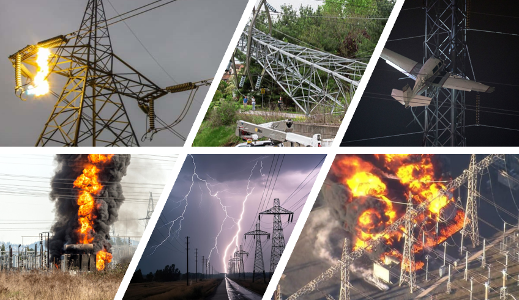

*Figura 3. Ejemplo de eventos de corto circuitos en sistemas de transmisión en alta tensión.*

Actualmente, los relés de protecciones son ajustados por equipos de ingeniería de forma manual y repetitiva, en este proyecto se busca proponer una solución mediante el análisis de datos y la analítica predictiva que permita facilitar el proceso de detección de fallas eléctricas en los sistemas de alta tensión.

## Marco teórico

Cuando sucede un cortocircuito en un sistema eléctrico de potencia, una corriente anómala de operación usualmente de gran magnitud (del orden de kA) circula por todos los elementos de la red. Dentro de cualquier subestación de alta tensión, sin importar su configuración, siempre se cuenta con una bahía de conexión. Dentro de esta bahía se encuentran dos elementos de medida, el transformador de potencial (PT por sus siglas en inglés Potential Transformer) y el transformador de corriente (CT por sus siglas en inglés Current Transformer), estos equipos toman registros de tensión [ v(t) ] y de corriente [ i(t) ], donde dicha información constituye la fuente de datos desde el sistema de potencia.

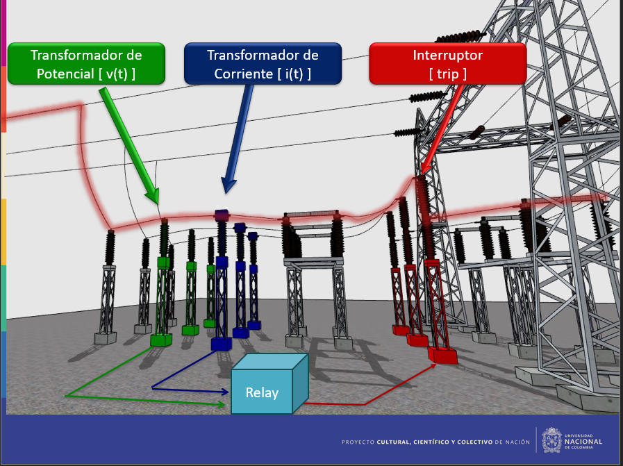
*Figura 4. Elementos de una bahía para una subestación de alta tensión.*

En la Fig. 4. se observa que desde los elementos de medida (el PT y el CT) se envían las señales de tensión y corriente al relé de protección. Este relé internamente cálcula la impedancia de falla fase-tierra (Zph-e) mediante la siguiente ecuación [1]:

$$Z_{ph-e} = \frac{V_{ph}}{I_{ph}+k_0\cdot I_n}$$

Donde el voltaje medido esta dado por la ecuación:

$$V_{ph}=m\cdot Z_{1L}\cdot (I_{ph}+k_0\cdot I_n)+R_F\cdot I_F$$

Con:

* $V_{ph}:$ es el voltaje línea neutro medido en la barra S.
* $m:$ es la distancia en por unidad desde la barra S.
* $Z_{1L}:$ Impedancia de secuencia positiva de la línea.
* $I_{ph}:$ Corriente de fase medida en la barra S.
* $k_0=(Z_{0L}-Z_{1L})/(3Z_{1L})$.
* $Z_{0L}:$ Impedancia de secuencia 0 de la línea.
* $I_n:$ Corriente residual, o corriente de neutro medida en la barra S.
* $R_f:$ Resistencia de falla.
* $I_F:$ Corriente total que circula por la impedancia de falla.

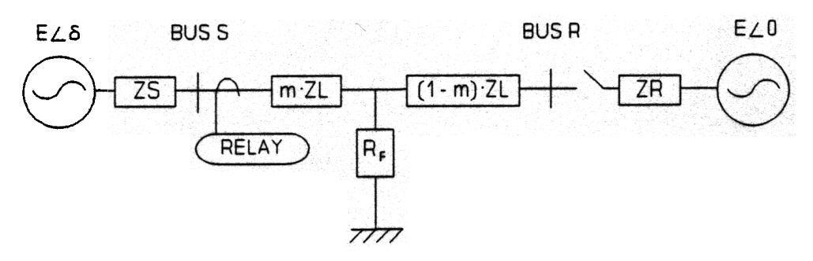
*Figura 5. Diagrama para el cálculo de impedancia durante un cortocircuito.*

Notar que si bien es cierto que es posible estimar el valor de la impedancia medida por el relé en un cortocircuito, en la práctica esto no es viable, debido a la dependencia de variables aleatorias que son de alta dificultad de predicción, variables como la ubicación de la falla $m$, la resistencia de falla $R_F$ o el comportamiento de la carga $E\angle \delta$.

Hasta el momento ya se tiene la descripción teórica de los datos de entrada para un relé, sin embargo, ¿ Cómo debe ser la operación de estos dispositivos ?, para responder esta pregunta se presenta el siguiente ejemplo:

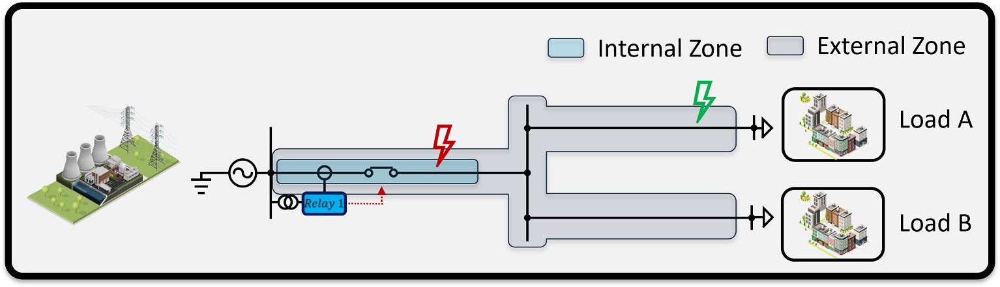
*Figura 6. Red para ejemplificar la operación ideal de un relé.*

En la Fig. 6 se observa un generador eléctrico a la izquierda y dos cargas (Load A and B) a la derecha, las cuales fácilmente pueden representar ciudades enteras. El relé "Relay 1" debe disparar el interruptor de la bahía de generación ante fallas en su zona interna (presentada en azul), y no debe operar ante eventos en su zona externa de protección (presentada en gris). En otras palabras, el relé debe operar en el cortocircuito mostrado en rojo, y no debe operar en el corto circuito presentado en verde.

* **Descripción del problema ante una operación indeseada:** Supongamos un escenario en el cual la ciudad "A" presenta un corto circuito asociado a una tormenta eléctrica, si el "Relay 1" clasifica mal el evento y lo cataloga como falla interna, se producirá un disparo del interruptor en la subestación de generación, dejando sin energía eléctrica a las ciudades "A" y "B", notar que en este ejemplo la ciudad "B" perdió suministro eléctrico de forma innecesaria pese a no presentar condiciones anómalas.

En la Fig 7. se presenta una representación del ajuste de coordinacion de relés de protecciones tradicional en un plano de impedancia R-X, utilizando poligonos.

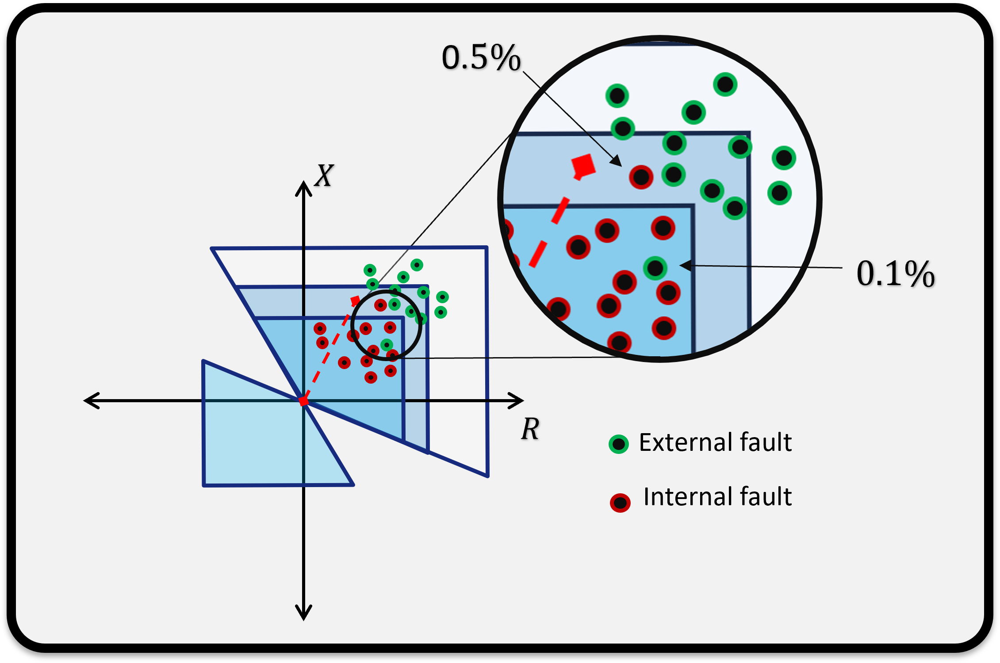
*Figura 7. Ejemplo de segmentación tradicional mediante el uso de poligonos en un relé ante falla internas y externas.*

## Objetivos

* Obtener un dataset para los registros de falla en los diferentes relés de un sistema de potencia.

* Realizar la clasificación entre fallas internas y fallas externas de los relés de protecciones para un sistema eléctrico de potencia.

* Validar el desempeño de diferentes modelos de inteligencia artificial para el ajuste de los relés distancia.

## Descripción del dataset

Para la creación del dataset se utiliza el sistema de potencia de 39 barras en New England, este sistema es ampliamente utilizado para el análisis de estabilidad transitoria y de pequeña señal, por lo cual el modelo digital se encuentra completamente definido a detalle en los diferentes softwares de análisis eléctrico.

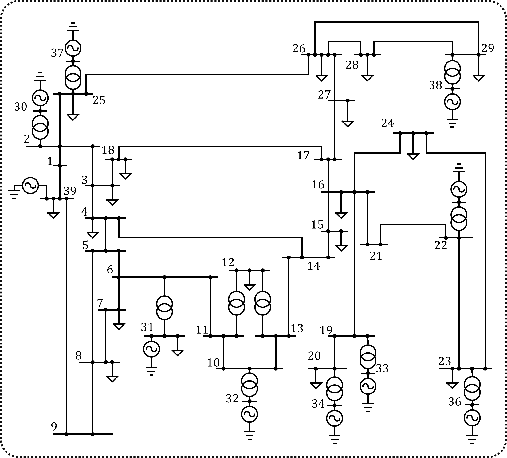

*Figura 8. Sistema de potencia de 39 barras en New England*

Para la implementación práctica del modelo digital de la red de New England se procede a utilizar el simulador [PowerFactory](https://www.digsilent.de/en/powerfactory.html) debido a que este es la principal herramienta de simulación para los diferentes TSO (Transmission System Operators) en varios países del mundo (Ej: Reino Unido).

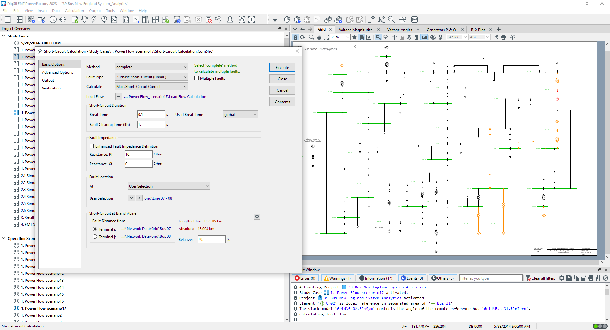

*Figura 9. Software PowerFactory*

Una de las grandes ventajas del simulador [PowerFactory](https://www.digsilent.de/en/powerfactory.html) es que nos permite interactuar con el a traves de una API con Python. Utilizando dicha API se crea un automatismo el cual va a ejecutar fallas eléctricas a en los diferentes componentes de la red, y va a almacenar los datos de medición asociados a cada uno de los relés de protección.

Las caracteristicas de las fallas a considerar son:

**Ubicación relativa:** [1%, 10%, 20%, 30%, 40%, 50%, 60%, 70%, 80%, 90%,99%].

**Resistencia de falla:** [0 Ohms, 2.5 Ohms, 5 Ohms, 7.5 Ohms, 10 Ohms]

*(Notar que resistencia de falla superiores a 10 Ohmios no sé consideran en este tipo de estudios, de hecho el código de redes en Colombia obliga a los operadores de red a garantizar el disparo de los relés al 50% de la línea con 5 ohmios de impedancia de falla)*

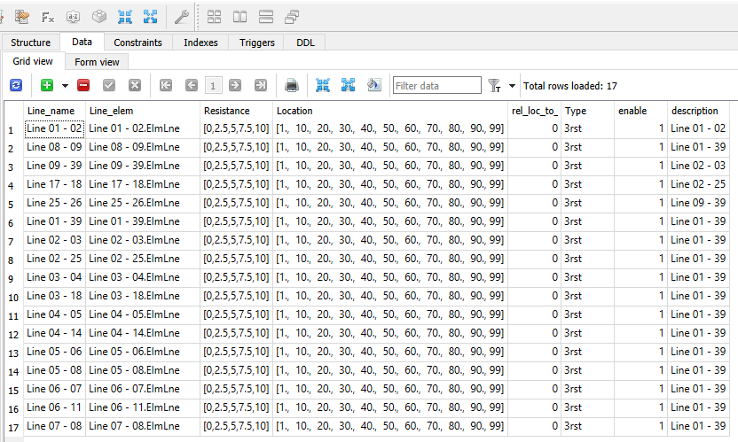
*Figura 10. Input en SQL para definir los diferentes escenarios de cortocircuito utilizados para generar el dataset.*

### Escenarios de operación

Una de las variables que dificulta la coordinación de protecciones es la variabilidad en la carga. Estas variaciones son prácticamente de naturaleza aleatoria, aunque se encuentran estimadas por los planeadores de red en cada país. (Notar que acá hay un tema amplio de investigación en analítica predictiva que es la estimación de la futura Demanda de energía eléctrica).

Para el análisis a realizar en este trabajo, se asume que ya se cuenta con la predicción de demanda, y se utilizan dichos valores como entradas para el estudio. Para la creación del dataset se considera un total de 17 escenarios de operación de la red. Notar que este es un número muy amplio de escenarios que humanamente no es posible analizar de forma manual. Como referencia, en Colombia se pide normalmente el análisis en tan solo tres escenarios de despacho, bajo-medio-alto consumo de energía.

El análisis teórico de como se impacta el voltaje, la corriente, y la impedancia medidas por un relé se presenta en [1], si bien es posible hacer estos cálculos a mano, el tiempo requerido sería muy alto, es por ello que recurrimos al uso de herramientas como simuladores eléctricos para resolver las ecuaciones diferenciales asociadas a la red y entregar el comportamiento fidedigno de la red real con su gemelo digital.

|              | Load_03 | Load_04 | Load_07 | Load_08 | Load_12 | Load_15 | Load_16 | Load_18 | Load_20 | Load_21 | Load_23 | Load_24 | Load_25 | Load_26 | Load_27 | Load_28 | Load_29 | Load_31 | Load_39 |
| ------------ | ------- | ------- | ------- | ------- | ------- | ------- | ------- | ------- | ------- | ------- | ------- | ------- | ------- | ------- | ------- | ------- | ------- | ------- | ------- |
| Escenario_1  | 300     | 400     | 100     | 200     | 500     | 200     | 100     | 300     | 100     | 500     | 200     | 400     | 200     | 300     | 500     | 300     | 500     | 200     | 300     |
| Escenario_2  | 300     | 500     | 200     | 300     | 300     | 500     | 200     | 300     | 500     | 400     | 200     | 500     | 500     | 500     | 300     | 400     | 100     | 200     | 300     |
| Escenario_3  | 100     | 400     | 400     | 100     | 400     | 300     | 200     | 200     | 500     | 400     | 200     | 500     | 500     | 400     | 200     | 300     | 100     | 100     | 400     |
| Escenario_4  | 200     | 200     | 400     | 500     | 400     | 500     | 300     | 400     | 100     | 200     | 100     | 500     | 300     | 400     | 500     | 100     | 200     | 400     | 200     |
| Escenario_5  | 100     | 500     | 500     | 300     | 300     | 400     | 500     | 300     | 400     | 500     | 500     | 400     | 300     | 100     | 100     | 300     | 200     | 300     | 400     |
| Escenario_6  | 100     | 500     | 500     | 100     | 400     | 300     | 500     | 500     | 200     | 100     | 200     | 300     | 300     | 200     | 500     | 200     | 400     | 500     | 200     |
| Escenario_7  | 100     | 200     | 100     | 500     | 200     | 200     | 200     | 200     | 400     | 100     | 100     | 400     | 300     | 200     | 300     | 200     | 200     | 500     | 100     |
| Escenario_8  | 500     | 500     | 500     | 300     | 400     | 400     | 100     | 400     | 400     | 100     | 300     | 500     | 300     | 400     | 400     | 400     | 500     | 100     | 100     |
| Escenario_9  | 200     | 200     | 100     | 400     | 100     | 200     | 100     | 200     | 400     | 400     | 500     | 200     | 100     | 200     | 400     | 500     | 100     | 300     | 200     |
| Escenario_10 | 100     | 200     | 100     | 200     | 500     | 300     | 400     | 400     | 100     | 400     | 500     | 100     | 200     | 400     | 500     | 400     | 400     | 100     | 500     |
| Escenario_11 | 500     | 400     | 300     | 300     | 100     | 300     | 300     | 500     | 400     | 100     | 200     | 500     | 300     | 500     | 400     | 400     | 100     | 200     | 500     |
| Escenario_12 | 100     | 400     | 400     | 500     | 400     | 200     | 100     | 500     | 300     | 300     | 400     | 300     | 300     | 200     | 500     | 300     | 100     | 500     | 500     |
| Escenario_13 | 300     | 400     | 400     | 300     | 200     | 500     | 100     | 500     | 300     | 400     | 400     | 100     | 500     | 200     | 500     | 200     | 100     | 300     | 200     |
| Escenario_14 | 300     | 400     | 500     | 500     | 300     | 400     | 400     | 500     | 200     | 400     | 400     | 500     | 400     | 100     | 400     | 400     | 200     | 400     | 200     |
| Escenario_15 | 100     | 100     | 300     | 500     | 100     | 200     | 100     | 300     | 200     | 100     | 400     | 300     | 100     | 400     | 100     | 200     | 500     | 300     | 300     |
| Escenario_16 | 100     | 500     | 300     | 100     | 500     | 500     | 500     | 400     | 300     | 400     | 100     | 400     | 500     | 100     | 100     | 400     | 500     | 100     | 200     |
| Escenario_17 | 400     | 400     | 400     | 500     | 300     | 500     | 100     | 300     | 100     | 100     | 500     | 500     | 500     | 100     | 400     | 100     | 400     | 500     | 500     |

*Tabla 1. Escenarios de consumo de energía considerados para el estudio de protecciones.(Unidades dadas en MW).*

### Dataset Generado

Considerando todo el modelado matemático realizado en el simulador eléctrico, el resultado final obtenido es un dataset con 119_680 datos por escenario, para un total de 2_034_560 datos en total. Como referencia, el computador i7 con 32Gb de RAM tardó 6 días en generar todos los cálculos.

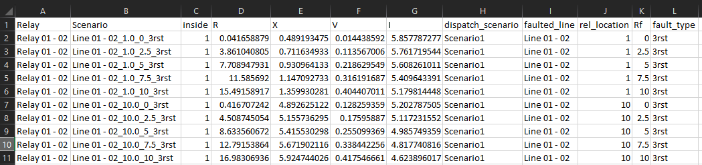

*Figura 11. Dataset de fallas*

### Descripción de las columnas del dataset

* **Relay:** Identificador del relé del registro.

* **Scenario:** Identificador del escenario de cortocircuito analizado.

* **inside:** Variable que determina si la falla analizada se encuentra dentro de la zona de protección del relé. (En este trabajo inicialmente no se considerán zonas de protección de respaldo Z2,Z3,Z4R; por lo tanto, la variable inside=1 corresponde a la Z1 de protección del relé).

  * **Is_inside** = 1 -> trip -> diparo -> se abre el circuito -> desconecto carga

  * **Is_inside** = 0 -> no trip -> no disparo -> no abre el circuito -> no desconecto carga

  **Nota:** *La variable inside corresponde al target del modelo, dado que esta es la señal crítica que implica desconectar un elemento del sistema de potencia. Esto en la vida real puede implicar apagar una ciudad o inclusive apagar un país.*

* **R:** Cálculo del valor real de la impedancia de falla registrada apartir de las mediciones de tensión y corriente en la subestación. (Resistencia durante la falla) [Ohms].

* **X:** Cálculo del valor complejo de la impedancia de falla registrada apartir de las mediciones de tensión y corriente en la subestación. (Reactancia durante la falla) [Ohms].

* **V:** Voltaje medido con el transformador de potencial (PT) durante el evento de corto circuito [p.u.].
    El simulador PowerFactory entrega esta señal como una medida en por unidad, con tensión base 345kV, es decir, que para obtener la tensión real del relé se debe aplicar la siguiente ecuación.

    $$V_{kV}=V_{Base}\cdot V_{p.u.}=345[kV]\cdot V_{p.u.}$$

* **I:** Corriente medida con el transformador de corriente (CT) durante el evento de corto circuito [kA].

* **dispatch_scenario:** Escenario de despacho al cual corresponde la medida tomada, recordar que se definieron 17 escenarios de demanda para el estudio.

* **faulted_line:** Línea de alta tensión sobre la cual se ejecuta el evento de corto circuito.

* **rel_location:** Ubicación relativa sobre la cual se ejecuta la falla. En la vida real para una línea de 300km los corto circuitos pueden ocurrir en cualquier tramo de la línea, si suponemos que cae una descarga atmosferica en el kilometro 30 de la línea, este evento estaría representado con un rel_location de 0.1, es decir, al 10% de la línea. Adicionalmente, esta ubicación se considera siempre respecto al primer indice del elemento, es decir, si la falla tiene un 0.4 en rel_location sobre la línea "01 - 02" (163km), significa que el cortocircuito ocurrio al 40% de la línea (65.2 km) respecto a la subestación "01" y al 60% de la subestación "02" (97.8 km).

* **Rf:** Resistencia de falla. En el evento de corto circuito, dependiendo el material del elemento que ocasiona el evento se tendrá una resistencia de falla determinada, por ejemplo, si un objeto métalico hace contacto con la línea de alta tensión, dado que el metal es un conductor, la resistencia de falla es muy cercana a 0 (La resistencia es una variable eléctrica que mide la tendencia a la oposición del flujo de corriente, por lo cual al ser un conductor la oposición sería cercana a 0). En caso de que el elemento que haga contacto con la línea fuese la rama de un árbol, dado que el materia sería la madera, la resistencia de falla tendería a incrementarse. Para garantizar que se cubre una mayoría de casos críticos de corto circuito, se consideran variaciones desde 0 ohms hasta 10 ohms.

* **fault_type:** En los sistemas de transmisión trifásicos es posible tener diferentes tipos de falla, por ejemplo en una línea de alta tensión se cuenta con tres conductores principalmente, y un conductor adicional conocido como cable de guarda, al momento de ocurrir con corto circuito, diferentes combinaciones se pueden presentar, por ejemplo una falla monofásica a tierra, o una falla bifásica aislada de tierra. Por practicidad en el dataset a generar se consideran únicamente fallas trifásicas en la red. Sin embargo para trabajos futuros es posible considerar todos los tipos de falla.

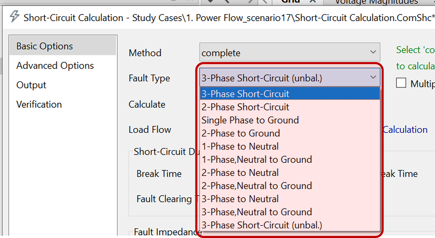

*Figura 12. Selección de una falla trifásica en PowerFactory*

Para el cálculo del corto circuito, se tiene disponible utilizar el estándar VDE 0102 Part 0,el DIN EN 60909-0, el IEC 61363, el IEC 61660 ó el IEC 60909. Sin embargo, se tomó la decisión de no utilizar ninguno de estos estándar, dado que estos utilizan factores de corrección que afectan los resultados, pero que son útiles para problemas como el dimensionamiento de la subestación. Uno de los problemas críticos de utilizar estos estándares, es el c-factor, de 1.1 para el nivel de tensión utilizado (345kV), dicho factor representa el valor máximo de tensión en p.u. esperado en la red, pero no representa como se observaría el fenómeno real. Considerando lo anterior, se opta por correr las simulaciones mediante el método Completo, en dicho método se corre un flujo de carga inicial para obtener los valores de tensión/corriente prefalla, y así se evitan aproximaciones de diseño. Al utilizar este método de cálculo se garantiza una mejor representación del evento de corto circuito.

### Exploración del dataset

Como se menciona en la sección anterior, el dataset cuenta con 2.006.400 observaciones, 12 columnas y ningún *missing value*, esto debido a que no hay errores en al convergencia de la simulación. Las columnas del dataset se describen a continuación:

0. **Relay:** object
1. **Scenario:** object
2. **inside:** int64  
3. **R:** float64
4. **X:** float64
5. **V:** float64
6. **I:** float64
7. **dispatch_scenario:** object
8. **faulted_line:** object
9. **rel_location:** float64
10. **Rf:** float64
11. **fault_type:** object

Revisando los principales estadísticos de las variables cuantitativas, se observa la variable *inside* que es el *target* del proyecto, tiene la mayoría de valores en 0. La ubicación del relé esta uniformemente distribuída entre los valores de 1 a 100 y los valores del componente real y complejo de la impedancia, el voltaje y la corriente tienen valores que se desvían considerablemente de la media.

|   | inside | R | X | V | I | rel_location | Rf|
| ------- | ------- | :-------: | :-------: | :-------: | :-------: | :-------: | :-------: |
|count | 2,006,400 | 2,006,400 | 2,006,400| 2,006,400| 2,006,400| 2,006,400| 2,006,400|
|mean|0.059|6.870995e+16|6.886670e+16|0.674|1.402|50.000|5.000|
|std|0.236|4.866293e+19|4.877397e+19|0.227|1.478|31.337|3.536|
|min|0.000|-7.688535e+04|-3.706182e+04|0.001|0.000|1.000|0.000|
|25%|0.000|-6.821500e+01|-8.294000e+01|0.518|0.558|20.000|2.500|
|50%|0.000|3.789000e+00|4.377000e+00|0.721|0.914|50.000|5.000|
|75%|0.000|7.152300e+01|9.412800e+01|0.860|1.876|80.000|7.500|
|max|1.000|3.450000e+22|3.458704e+22|1.018|42.765|99.000|10.000|

## Metodología

### Descripción de métricas de desempeño

Entendiendo que el modelo a trabajar pertenece a los problemas de clasificación, las métricas disponibles en sklearn para el desarrollo y evaluación de los modelos son:

    ‘accuracy’, ‘balanced_accuracy’, ‘top_k_accuracy’, ‘average_precision’, ‘neg_brier_score’, ‘f1’, ‘f1_micro’, ‘f1_macro’, ‘f1_weighted’, ‘f1_samples’, ‘neg_log_loss’, ‘precision’, ‘recall’, ‘jaccard’, ‘roc_auc’, ‘roc_auc_ovr’, ‘roc_auc_ovo’, ‘roc_auc_ovr_weighted’, ‘roc_auc_ovo_weighted’

Adicionalmente se cuenta con la matriz de confusión dada por:

*Figura 23. Ejemplo de matriz de confusión*

En el caso de estudio un valor positivo indica un disparo de la protección, mientras que, un valor negativo indica una omisión de disparo.

Dentro de la teoría de protecciones eléctricas existen dos conceptos de alta importancia asociados a la confiabilidad de la red, la seguridad y la fiabilidad.

* **La seguridad (Security):** se refiere a evitar la desconexión inecesaria de activos no afectados durante el evento de corto circuito, normalmente este concepto es el de mayor interés entre los usuarios de la red, dado que nadie quiere que le quiten el suministro de energía, y menos ante eventos asociados a circuitos externos.

* **La fiabilidad (Dependability):** Durante el evento de corto circuito, todos los elementos del sistema de potencia que esten aportando corrientes de corto van a sufrir daños por calor, por fuerzas asociadas al efecto Lorentz, etc. Esto compromete la vida útil de los equipos, y en el peor de los escenarios los puede sacar de operación de forma permanente. La fiabilidad se refiere al enfoque donde ante cualquier condición que pueda afectar la vida útil del activo se realiza una desconexión del mismo para salvaguardar la integridad de los dispositivos.

Podemos ver que tenemos dos enfoques contrarios que entran en conflicto al momento de diseñar un esquema de protecciones, por un lado queremos proteger los equipos desconectandolos para aislar la falla, y por otro lado buscamos no afectar a los usuarios. El punto óptimo se presenta en la siguiente figura.

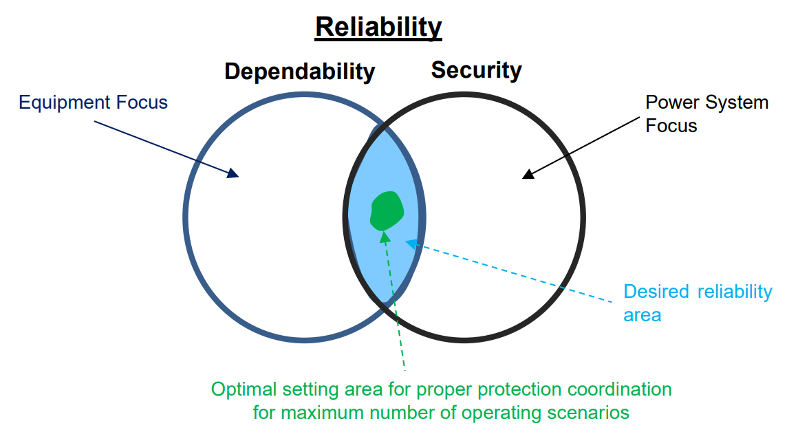

*Figura 24. Fiabilidad, seguridad y zona óptima (Tomado del reporte más reciente de IEEE PES en el tema de "Practical Applications of Artificial Intelligence and Machine Learning in Power System Protection and Control." en septiembre 2023)*

Dado que al perder un equipo del sistema de potencia, reponerlo puede tardar desde días hasta meses. Como criterio de diseño, le daremos prioridad a la fiabilidad sobre la seguridad. Esto significa que, dada la naturaleza del problema, debemos evitar al máximo los Falsos Negativos. Es decir, si el elemento a proteger efectivamente tiene el corto, debemos garantizar el disparo de la protección. Realizar una desconexión innecesaria de elementos (Falso Positivo) aunque no es algo deseable, puede implicar un impacto poco significativo. Mientras que, un elemento en corto circuito que no despeje la falla (Falso Negativo) si puede representar un colpaso total de la red y una posible destrucción de los activos del sistema.

Considerando el análisis anterior, la métrica de desempeño **$Recall$** va a tener preferencia sobre la métrica **$Precision$**. Sin embargo, esto no quiere decir que la métrica objetivo a maximizar sea el $Recall$, porque si ese fuera el caso, el modelo aprendería a siempre disparar los interruptores (Desconectar elementos), es decir, para cualquier corto circuito de la red, todos los usuarios perderían el suministro eléctrico.

$$Precision=\frac{TP}{TP+FP}=\frac{(Disparo\ en\ elemento\ fallado)}{(Disparo\ en\ elemento\ fallado)+(Disparo\ en\ elemento\ no\ fallado)}$$

$$Recall=\frac{TP}{TP+FN}=\frac{(Disparo\ en\ elemento\ fallado)}{(Disparo\ en\ elemento\ fallado)+(No\  Disparo\ en\ elemento\ fallado)}$$

Una opción para la métrica objetivo a considerar para este proyecto podría ser el $f_{1 score}$, dado que, este score nos permite conocer un balance global entre el $Recall$ y el $Precision$.

Otra opción, quizas más acertada para este problema en particular, que podría llegar a ser utilizada en caso de ser necesaria sería el [F beta score](https://scikit-learn.org/stable/modules/generated/sklearn.metrics.fbeta_score.html).

$$F_{beta} = \frac{((1 + \beta^2) \cdot Precision \cdot Recall) }{ (\beta^2 \cdot Precision + Recall)}$$

Es muy importante que en caso de requerirse el uso del Fbeta score, $\beta$ debe tomar un valor superior a 1, para darle preferencia al $Recall$ sobre el $Precision$, un valor de $\beta=2$ suele ser utilizado en problemas típicos de aprendizaje de máquinas.

En caso de analizar el "Accuracy" del modelo, también se tendrá preferencia en utilizar el "balanced_accuracy" dado que el dataset es altamente desbalanceado.

$$balanced\_ accuracy=\frac{1}{2}(\frac{TP}{P}+\frac{TN}{N})$$

## Desarrollo de modelado

Para el entrenamiento del modelo se deben utilizar las variables ["Relay","R","X","V","I"], dado que estas son las variables que son medibles en campo, si bien el dataset cuenta con columnas como "fault_location", en la vida real no es posible determinar donde ocurre la falla con sensores electrónicos, esta ubicación debe ser determinada a partir de las variables eléctricas "R", "X", "V", "I".

Adicionalmente, la variable "Dispatch_scenario" podría ser considerada en los modelos, sin embargo, se debe tener en cuenta que para tener disponible esta variable en campo, se debe contar con un esquema complejo de redes de telecomunicaciones para informar a todas las subestaciones del estado de toda la red. Esto es posible, pero con lleva un costo considerablemente alto en la implementación en la vida real.

Aún así no es algo imposible, y se puede pensar en problemas de ingenería de telecomunicaciones para utilizar los canales existentes utilizados para las teleprotecciones, para usar información similar a los disparos directos teletransferidos, "Permissive Overreaching Transfer Trip (POTT)", "Permissive Underreaching Transfer Trip (PUTT)", o "Blocking Schemes".

## Conclusiones

## Trabajo Futuro

* El trabajo realizado se enfocó principalmente en la identificación de la zona de disparo instantaneo Z1 y en la zona de no operación, dado que esta es la funcionalidad de protección principal en los relés, sin embargo, los relés en la vida real también pueden dar protección de respaldo a los circuitos adyacentes a la zona protegida, en este caso se pasaría de un problema de clasificación binaria, a uno de clasificación categórica. Para poder realizar este modelo de mayor complejidad se requiere crear un vector objetivo (Y_target) basado en un análisis topológico de la red, incluyendo los criterios de experto para el ajuste de relés de protección. Una implementación real de este tipo de estrategias para el ajuste de relés tradicionales se presenta en [7].

* El trabajo realizado se puede combinar con otros trabajos existentes de ajuste de relés tradicionales, posteriormente se puede integrar un ensamble de modelo para mejorar la detección de fallas eléctricas en sistemas de potencia real.

# Referencias

[1] J. Roberts, A. Guzman, and E. O. Schweitzer, III
Schweitzer Engineering Laboratories, Inc. Z=V/I Does Not Make a Distance Relay. Disponible en: <https://selinc.com/api/download/2429/>

[2] Scikit learn. Metrics and scoring: quantifying the quality of predictions. Disponible en: <https://scikit-learn.org/stable/modules/model_evaluation.html>

[3] Power System Relaying and Control Committee
Subcommittee C – System Protection
Working Group C43. Practical Applications of Artificial Intelligence and Machine Learning in Power System Protection and Control. Disponible en: <https://resourcecenter.ieee.org/publications/technical-reports/pes_tp_tr112_psdp_090523>

[4] Bordes. A, Fast Kernel Classifiers with Online and Active Learning. Journal of Machine Learning Research 6 (2005). Disponible en: <https://citeseerx.ist.psu.edu/viewdoc/download?doi=10.1.1.60.9676&rep=rep1&type=pdf>

[5] Scikit Learn. Scikit=learn Machine Learning in python. Disponible en: <https://scikit-learn.org/stable/>

[6] Mohamed Abdelhamid, Essam H. Houssein, Mohamed A. Mahdy, Ali Selim, Salah Kamel, An improved seagull optimization algorithm for optimal coordination of directional over-current relays, Expert Systems with Applications, <https://doi.org/10.1016/j.eswa.2022.116931>.

[7] Juan F. Piñeros, Intelligent model to automatically determine and verify distance relays settings, Electric Power Systems Research, Volume 217, 2023, <https://doi.org/10.1016/j.epsr.2023.109137>.

[8] WECC, 2021 Misoperation Report, Relay Work Group. <https://www.wecc.org/Administrative/RWG%202021%20Misoperation%20Report-RRC.pdf>

[9] Hanyu Yang, Xubin Liu, Di Zhang, Tao Chen, Canbing Li, Wentao Huang, Machine learning for power system protection and control, The Electricity Journal, Volume 34, Issue 1, 2021,<https://doi.org/10.1016/j.tej.2020.106881>.

[10] Abder Elandaloussi, et al. “Practical Applications of Artificial Intelligence and Machine Learning in Power System Protection and Control”, Power System Relaying and Control Committee
Subcommittee C – System Protection, Working Group C43, IEEE PES.

[11] Aminifar, F., Abedini, M., Amraee, T. et al. A review of power system protection and asset management with machine learning techniques. Energy Syst 13, 855–892 (2022). <https://doi.org/10.1007/s12667-021-00448-6>
